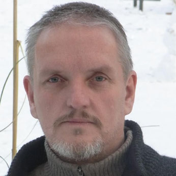

# About the Author  
  

A. Artananda was born on the 20th of November in 1963. His parents gave him the name Olaf. His star-sign is the scorpio and he was born in Hamburg.  
After mastering secondary school he completed an apprenticeship as a machinist. Because this work does not fulfill him, he decided to learn software development and later he studied graphics design and human computer interaction design.  
After more than 30 years of software development he finally worked for a bank in Switzerland.  
This carrier was not without side effects so he was struggling with two burnout's.  
2014 he left Switzerland and moved to Denmark. Since then he has not worked for profit anymore.  
Now he is living in a mobile home writes open source software, gives tantric massages and workshops and writes books.