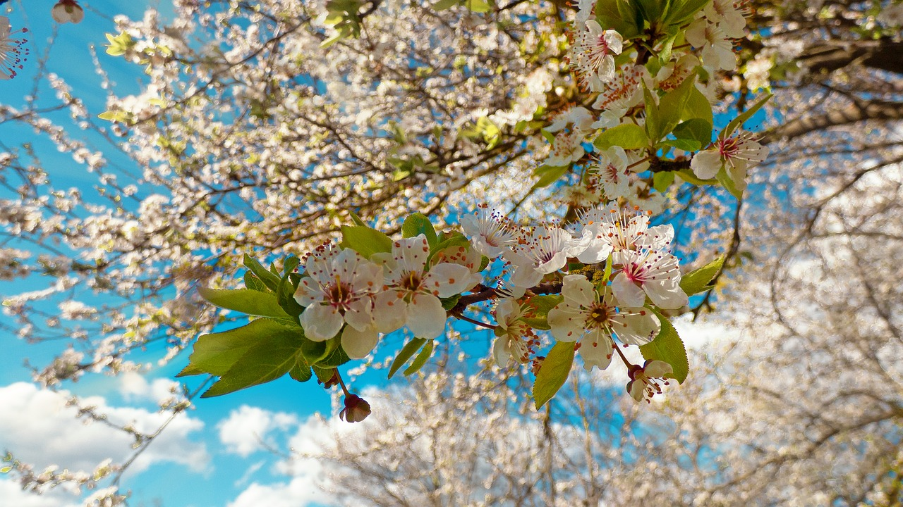

#How it all began

"Grandpa, can you please please tell us the story.", says Puri, after she had shaken me in my hammock to wake me from my afternoon nap.  

"All right," I replied. "Let's go to Sven's workshop. I can show you something there."  

"Hi Sven, may I use your workshop for a while to show the kids how we used to work in the past?", I ask Sven who immediately agreed.  

"In the past, people used to work in workshops like this, depending on what job they had learned. Here, items such as cabinets, tables, chairs, toys and so on were made. The workshops used to be a lot bigger than this one. Hundreds of people were busy there and made things that were either useful or just put somewhere as ornaments. Earlier everyone had to work to afford food, rent for flats, cars, computers, and so on."  

"Why did people have to pay for food and what is a rent?", asks a little boy from Guatemala.  

"Well," I answered, "In the old days all the land belonged to other people who took it from us all. So we could not grow fruit and vegetables and had to buy it from the other people who owned the land."  

The little boy asked, "Why did they take the land away from you?"

"Well, I can not tell you that. I only know when I was born that they already had the land. And there were laws, and when you entered someone else's country to pick an apple, for example, other people sometimes came with weapons and took us and locked us up because it was forbidden to do so."  

"It was forbidden to eat?", the little boy wants to know.  

"No, it was forbidden to take something away from other people," I answer.  

"You wanted to know what rents are. There used to be houses on the land of other people. You could live in these houses, but you had to pay money for every month. And this was then called rent.", I explained.  

"I've heard the word money before. What did that mean? ", another boy wants to know.  

"Money was something people used to trade. Imagine you have an apple tree in the garden and your neighbor has a pear tree in the garden. Now you would like to eat a pear because eating only apples all the day does not make you very happy."  

"Yes, if I want to eat a pear, then I just pick one," says the other little boy.  

"You're right," I answered, "but that used to be different. As I said, it was forbidden to take anything from another. So you had to pay money for a pear. Of course you could have exchanged the pear for an apple, but if the person with the pears does not like to eat an apple at the moment, then he prefers to take the money and later buys an apple from it or he uses the money to pay his rent or something else. At that time almost everything cost money. The money was in form of paper and as coins. If you wanted to buy a pear, then you gave the so-called seller either enough coins or a paper banknote."  

The children listened to my words as if I were just telling them a fairy tale. I can imagine that all this must be very strange and exciting for the children.

"Did everyone have apple trees so they could sell their apples?", a girl wants to know.
  
"No, I already said that the land belonged to the other people. You could have bought land yourself, but you needed a lot of money for that. In order to make money earlier, you had to go to work. Working meant we had to walk or drive from the morning before the sun came up to work, where we did things for the other people and then went back home when the sun went down."  
  
"You want to hoax us," says one of the children.  

"No, that was really the case back then. Admittedly not all people worked in workshops but were allowed to work outside in the sun. But that was not so nice, because you were dragging heavy things around and sweat quite a lot. Some of them were better off, they were allowed to give orders to others and tell them what they had to do, but in return they had to listen to such strange stories from other people for a long, long time, until they believed it. This was called studying earlier."
  
"My grandma once said that she was studying because she did not feel like working.", comes out of one of the guys. Everyone laughed.
  
"Yes, working was not really nice. But none of us knew anything else. When I got sick because I had worked so much, I realized that it could not go on like this. I remembered my childhood. Since we had 3 apple trees in our garden. When I was hungry, I picked an apple. At that time I realized that there can be a life without work and money, because eating apples was free for me."
  
"Do I have to work too?", asks a little girl.
  
"No," I told her, "but if you want that, then you can try it out. Not every job was bad. For example, there were people who helped others with their problems, which can be fun, or rather, it feels good to do so. There is, for example, the masseur, who was able to massage away the pain of many other people. There are still people who do that today. For example, I massage other people to make them feel better. But I do not see that as work. I also do not get any money for it, but I very much like to do it. "
  
"You said people worked from morning to evening. Did they do that every day?"
 
"Yes, in some countries, people have worked every day. Even children of your age have done that. Were I came from we only worked 5 days a week. 8 hours each day. So we had a bit more free time and that's why we did not think it was that bad, otherwise we would have rebelled much earlier."
  
The bad thing was, every person had to somehow earn money to be able to afford food, rent, etc. And if you have not found a job. Then you had to take something away from other people, so you did not have to die. In addition, the government has created insecurity due to insecure jobs and last but not least, sanctioning social assistance because timid citizens are more controllable. That did not have much to do with democracy. And because everyone had to earn money, useless things have been made that no one needed. And for people to have bought the useless stuff, they kept talking to them and put up signs everywhere saying, "You have to buy my things, because without my things, you're a nobody." And many people have believed that at some point, because everyone has said, yes buy that. Over and over again. People even spent money on poison and inhaled or drank it, for example, as a smoke. Just because they have been told that everyone does that and that it's part of it."  
 
"I think I can not sleep well tonight," says one of the girls.
  
"Yes," I said, "we better end today." 
