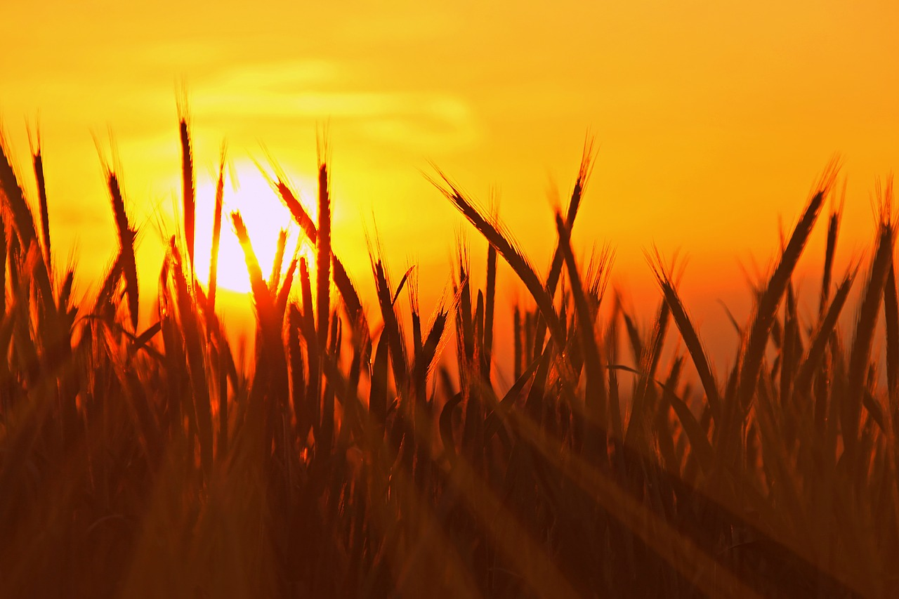

#Camp Eden  

"Hi Felix", I say as Felix approaches, "do you have a moment?"  
  
"Of course", answers Felix.  
  
"I would like to show you the camp. A lot has happened to us since you were away."  
  
"You're welcome, I'll just let Dora know quickly, she had already asked for it", says Felix and leaves.  
  
"A wonderful good morning I wish you daddy, come let me hug you.", says Dora.  
  
"Hey, my heart"  
  
"Felix says you want to show us the camp," says Dora.
  
"Yes, come with me."  
  
We go a bit.  
  
"Here on this place, the new tepee is to be built. We are currently testing a new substance. It should now be waterproof. The teepee will be 6 meters in diameter and will seat about 30 people."  
  
"Here we have built a massage and tantra temple.", I point to the new dome, which consists of triangular parts and is covered with a tarp.  
  
"If you want, you can learn the Prana-Flow-Massage from me later, I'll show it to Mike later and I think you both do not know it yet."  
  
"Gladly", says Dora.  
  
"When?", asks Felix.  
  
"I would say, an hour after the food circle", I counter.
  
We continue to the wind turbine. "You know the windmill, right?"
  
"Jup", sounds Dora.
  
"We feed some old car batteries here. The power is actually only for our pump, with which we promote the water from the well. Have you already been in the bathroom?", I want to know.  
  
"Nope," says Felix.  
  
"Ah, nice", Erik tiled the bathroom for us, but see for yourself.  

"The bathroom looks nice," says Dora.  
  
"Yes", I answer ... and the great thing is, we use the water several times for showering and bathing, as it flows through a sewage treatment plant and then can be used again. The part that evaporates, we pump out of the well, "I tell.  
  
"Come on, let's go to the field," I say.  

  

"Look, rye as far as the eye can see. We make the bread we bake here in abundance and give it to our neighbors. They provide us with grapes, olives and walnuts.", I tell.  
  
"Do you bring in the rye with your hand?", Felix wants to know.  
  
"Yes, that's what the boys are doing. We told them that this work make them look better and impressed the girls."  
  
"Did they fall for it.", Dora wants to know.  
  
"Well, they are not stupid, but they still do it to do us a favor.", I grin, "and besides, there is always a Thanksgiving and then the boys and girls from the surrounding area Camps take part."  
  
"Will you show us the wood workshop, please?", says Felix.  
  
"Come on, let's see if Sven is here. Oh by the way, our teens live in this house over there. Here they can get a little sniff and shame, so they are not later sexually blocked."  
  
"I noticed that here nobody is working as much as in our camp," says Dora.
  
"Yeah, sure", I reply, "you're just setting up your camp. We've been done with it for a few years now. The fruit and vegetables grow by themselves, the rye too, nobody is getting sick here anymore, we have got enough buildings to sleep in and what else should you work?"  
  
"I see," says Dora, "the name Eden is no coincidence. You have created a paradise here."