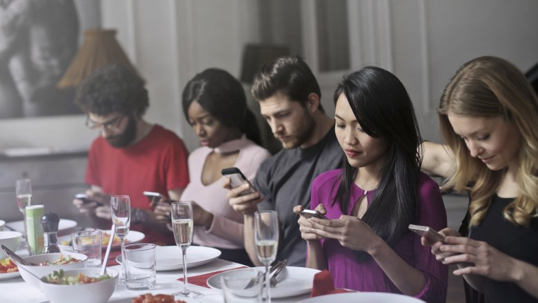

#The abolition of money
Mike, the boy's father, had already asked me yesterday how we got rid of the money. I just met him when I came to get the wood.  
  
„Hey Mike“, rief ich ihm zu, „wollt ihr nicht gleich zu mir kommen, dann kann ich euch die Geschichte erzählen, wie wir das Geld abgeschafft haben. Ich muss nur kurz das zum Main-Fire bringen.“
Mike nickte mir bejahend zu.  
  
„Schön, das ihr wieder alle da seid. Ich hatte ja gestern schon erwähnt, dass wir selber kaum noch Geld benötigten. Am Anfang haben wir das Grundeinkommen noch dafür benutzt, die Hypothek für das Camp abzuzahlen. Da wir aber alle zusammengelegt haben und unsere Essen selber angebaut haben, war das schnell abgezahlt.“  
  
„Was ist eine Hypothek?“, möchte eines der Mädchen wissen.  
  
„Eine Hypothek ist ein Vertrag, den man mit einer Bank abschließt. Mal angenommen du kaufst ein Grundstück für 16.000,- €, hast aber selbst kaum Geld. Dann gehst Du zur Bank und nimmst eine Hypothek auf. Die Bank schöpft die Summe von 16.000,- € einfach mit einer Buchung in ihrem Computer und bucht gleichzeitig diesen Betrag auf Dein Konto. Mit diesem Betrag kannst Du dann das Grundstück bezahlen. Bis Du es komplett abbezahlt hast, gehört das Grundstück allerdings noch der Bank. Nun mußt Du 10 Jahre lang jeden Monat einen Betrag von 150,- € an die Bank zahlen und das Grundstück gehört Dir. Wenn Du mitgerechnet hast, dann fällt Dir sicherlich auf, das du 18.000,- € zurück gezahlt hast, das liegt daran, daß die Banken Zinsen und Gebühren von Dir haben wollen.“  
  
„Was? Die wollen Geld dafür haben, das sie einmalig etwas in den Computer eingegeben haben? Die haben ja nicht mal ihr eigenes Geld verliehen.“, grummelt eines der Jungen.  
  
„Tja, so war das damals, deshalb wollten wir ja auch das Geld und damit die Machenschaften der Bankster abschaffen.“, sage ich.  
  
„Als wir das Grundstück abbezahlt hatten, brauchten wir selbst nur noch selten Geld. Viele andere Menschen folgten unserem Beispiel und nahmen ihr Grundeinkommen dafür, sich auch Land zu kaufen und waren dann irgendwann auch unabhängig.“  
  
„Kaum jemand benötigte danach noch Kredite oder Hypotheken. Nur noch die geldgierigen Menschen nahmen Kredite auf, um irgend sonnen Schrott zu produzieren, den eigentlich niemand brauchte. Als die gemerkt haben, das sie das Zeugs nicht mehr verkaufen konnten, gaben selbst die auf.  Es hat also irgendwann niemand mehr Geld benutz, also haben die Banken alle geschlossen.“  
  
„Was ich persönlich aber am Tollsten fand, ist die Tatsachen, daß kaum noch jemand zur Arbeit ging. Alle Menschen haben sich quasi selbst versorgt. Und da kaum jemand Geld verdient hat, hat auch kaum jemand Steuern gezahlt. Und da die Steuergelder ausgingen, hat die Regierung das Handtuch geworfen und ihre Arbeit eingestellt. Auch die ganzen Landesgrenzen wurden nicht mehr bewacht. Irgendwann gab es keine Grenzen mehr. Jeder Mensch durfte nun überall hinreisen.“  
  
Mike fragt, „Sag mal, was habt ihr gemacht, wenn ihr einen Computer oder ein Auto kaufen wolltet?“  
  
„Einige Dinge wie Computer und Autos wurden nicht mehr produziert, da wir auf der Erde genug davon hatten. Wer braucht schon alle zwei Jahre neue, schnellere Computer? Autos kann man reparieren, die muss man auch nicht immer neu kaufen. Ich habe ein paar Jahre in Dänemark gewohnt, dort erhob die Regierung 100% Steuern auf das Einführen eines neues Autos. Da in Dänemark selbst keine Autos gebaut wurden, hat man die Autos dort repariert. Dort fuhren damals sehr viele schicke Oldtimer rum.“  
  
„Was die Computer anging, so haben wir mit der Open Source Bewegung die wichtigsten Programme abgelöst, so dass die großen Softwareriesen keinen Gewinn mit ihrer Software mehr machen konnte. Das bedeutete, dass auch keine neue Hardware mehr weiterentwickelt wurde. Also es wurden keine neuen Prozessoren mehr entwickelt. Kein Mensch musste mehr eine neue Version des Betriebssystems installieren, nur weil sich die Hardware geändert hatte. Aus diesem Grund waren selbst Computer, die 20 Jahre alt waren, noch zu gebrauchen. Die Gesetze verhinderten auch, das Dinge hergestellt wurden, die nach kurzer Zeit verschleißen.“, ergänze ich.  
  
„Also um Deine Frage zu beantworten, wir haben keine neuen Dinge mehr gekauft. Und somit wurde die Produktion dieser Dinge auch fast komplett eingestellt“, sage ich, „Das ging sogar so weit, daß kein Erdöl mehr gefördert wurde und die Kohle wurde auch in der Erde gelassen.“  
  
Das mit dem Erdöl und der Kohle haben wir unseren Kindern zu verdanken. Sie fingen 2018 an Freitags zu streiken. Statt Freitags in die Schule zu gehen, gingen sie auf die Strasse und haben gegen den Klimawandel protestiert. Ein Jahr später haben dann auch die Erwachsenen mit demonstriert. Wir waren so lange auf den Strassen, bis die Regierung beschlossen hat, sofort die Gesetze für die alternative Energie zu erlassen. Der Kohleabbau wurde von Heute auf Morgen verboten und das Erdöl, das wir für Plastik und Benzin als Rohstoff benutzt hatten, wurde mit 300% Strafsteuer belegt. Viele Autofahrer haben sich darüber aufgeregt, aber am Ende waren sie alle froh durch die Autoleeren Städte mit dem Fahrrad fahren zu können. Das Plastik haben wir durch Hanfprodukte ersetzt. So ganz nebenbei wurde dann auch Marihuana legalisiert und Alkohol verboten ;-)    
  
„Ich habe gehört, das in Berlin immer noch Menschen leben, ist das richtig?“, fragt Mike.  
  
„Hehe, ja das stimmt.“, antworte ich, „Dort leben eine Hand voll Menschen, die das dortige Museum betreiben. Die ganze Stadt wurde zum Museum umfunktioniert“.  
  
„Man kann dort noch einmal den Kapitalismus und gleichzeitig den Kommunismus erleben.“, grinse ich, „Dort wird zum Beispiel noch eine U-Bahn betrieben. Sie wurde auf Solarstrom umgebaut und fährt automatisch ohne Lokführer. Auch gibt es dort noch Läden in denen man so zu sagen einkaufen kann. Zumindest wird das simuliert. Und auf der Ostseite sieht man das krasse Gegenteil. Dort gibt es auch Läden, nur haben die keine bunte Reklame wie im Westen. Dort haben die Leute Schaufensterpuppen in einer Reihe vor einem Geschäft aufgereiht, die eine Schlange aus Menschen darstellen soll, die Bananen kaufen möchte. Zu der Zeit, wo die Mauer noch stand, waren Bananen so selten, das, wenn es sie mal gab, sich die Leute stundenlang in die Schlange vor dem Laden einreihten. Aber wirklich witzig finde ich, daß das auch auf der Westseite inszeniert wurde. Nur dort gab es statt Bananen das „neue“ iPhone.“, lache ich.  
  
„Was ist denn iPhone?“, will ein Junge wissen.  
  

„Das iPhone war ein sogenanntes Smartphone, also eigentlich ein Telefon. Aber für ein Telefon hatte es wirklich sehr viele Features. Es war ein kompletter Computer mit einem Bildschirm, den man berühren konnte, wenn man ein Programm starten wollte.“  

“Das iPhone war damals DAS Kommunikationsmittel, man mußte keine langweiligen Gespräche mehr miteinander führen.“, witzel ich.  
  
„Zum Glück gibt es das nicht mehr. Da gehe ich lieber ein paar Meter auf jemanden zu, um mit ihm zu reden“, sagt Mike.
