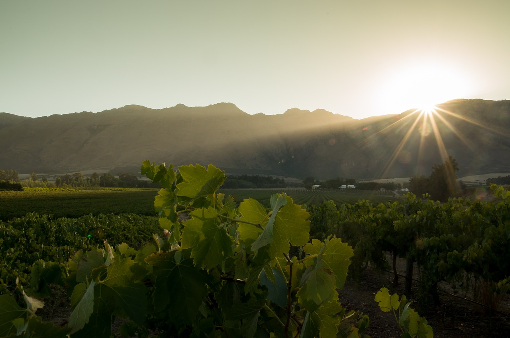
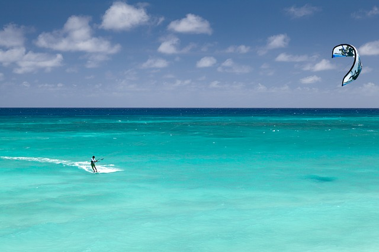
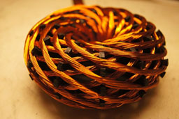

#A normal day in paradies

A warm sunbeam shining through the window in our tiny house lights up my eyelids as I wake up in the morning. "Nice," I think, "That's how I like being woken up." After stretching myself, I smell the wonderful taste of freshly baked bread and coffee. I hear sounds from the kitchen and see who is working so early. "Good morning my darling", I say, after I discovered my soul-mate.  
  
"Slept well?", she replies. "Would ya like some coffee and freshly baked bread?" 
  
"Of course", I say. She was still as beautiful as the first day when I saw her for the first time. And that is already many, many years ago.  
  
"Felix and Dora come this afternoon, they want to get some advice from you because they came across problems with the energy supply in their camp." 
  
"Okay", I say, "then I'm going to the beach this morning, a little bit kite-surfing. I can hear the wind, that means we have enough wind."  
  
Felix and Dora are our two twins. Just 16 years old and already building a community that they simply call "Camp". Actually Johanna, my soul-mate, whom I call "Jo" for short, could not have any more children at the age of 48, since she had been in her menopause for a long time. However, as she regularly practiced yoga and brachmacharia, her menstrual period was paused at the age of 45 and so we were led by the nose from the universe and we were given two additional wonderful children.
  
"Oh darling, I'll sleep with Lisa tonight", I say carefully, questioningly.  
  
"Oh, I think that's great of you, that you take care of Lisa. She has come a bit short in recent months, as John is currently helping out in Madagascar. But do not spend yourself so much! Otherwise there will be less for me.", she laughs. 
  
"Can you please pick up the dining table from Sven, when you come back from the beach", says Johanna.  
  
Sven takes care of the woodwork in our community and our table had to be treated a bit.   
  
"Please try the berries, which I harvested yesterday, my own breed."
  
Here in Portugal in the Algarve we have a community garden, where everyone can take something if needed. It is growing enough for everyone there. To be precise, we have 5 gardens here. Here in our community are living about 45 people. I do not know for sure, as some of them also like to travel to meet other communities and we also have some guests doing the same thing.  
We also grow our vegetables and bread for ourselves here. We also keep animals here, not to eat them, of course, but because we appreciate their closeness. They just walk around, free. We do not have fences. And if an animal runs away, then because it has found a similar animal to mate elsewhere. So its OK.  
  
"You certainly want to try the new kite that Bärbel sewed for you."  

"Yes", I reply, "She wanted to have the new material we got from the weaving shop tested. It will be used later for the new tepee."
  
Yes, we live here partly in tepees, yurts and smaller, self-built wooden houses. So living is much more fun than in the block of flats where we were crammed together like cattle.  
Such a teepee or a yurt also have a huge advantage. You can just take them with you when you move.
Johanna and me are living in a wooden container, or rather in two containers, which are connected with each other. It´s nice to take a shower in our house each day without wasting water, because we have got a plant purification, which cleans the water to be used again and again. We replace the evaporated water with rainwater. The water is also heated from the sun.

And so I spent the morning at the sea and Johanna was busy in the garden to cross new varieties of fruit with each other. 
  
"Hello Daddy, let me hug ya." 
  
"Hi, you are becoming a real woman."  
  
"Daddy, please, I was born that way already. I have to be nothing.", replies Dora.
"You're right again", I remembered. 
  
"And you Daddy apparently not getting older." 
  
I smirk, "Well you know that every 7 years our cells completely renew. Hey, how are you supposed to age?"

"You always with your superficial medical knowledge", Dora replied. 
  
"How do you know the word medical?", I want to know from Dora. 
  
"Oh, I met a man at the camp whom they call the 'medicine man' and he told me about the past when people still needed medicine and doctors."
  
"Haha, that was a long time ago", I remember. 
  
"Hi Daddy, I should tell you from Mama, that there will be a food circle right now, if you have not heard it. And hello, first of all.", says Felix when he came to meet me on the beach. 
  
"Hi Litt ... um ... you grew up", I say.  
  
"Yes," answered Felix, "I am now leading the construction of the camp together with my little sister." 
  
"Yes, thats exactly what I meant. You have that certain ... I remember building my first camp back then, how glad I was to have found my way."  

I started this first camp with the help of some rainbow brothers and sisters. The idea came to me at my first rainbow gathering in Angermünde, because I thought that instead of collecting money for the food circle, you could have grown the food because it was pure vegan. And that's exactly what we do in our camps today. Actually, it's a rainbow gatherings that last for several lunar cycles as we live here. And we grow our own food here. Unlike traditional gatherings, where you only stayed together from new moon to new moon and collected the money for your food in a hat called Magic Hat. If you still had work, you threw money in there after the food circle. At a food circle you sit in a circle around the fire and eat together.
These gatherings have really inspired me and others to do something like that all year round.
The philosophies of the UBUNTU movement from South Africa have shown us the way to accomplish this. Our camps are thus part of the UBUNTU movement, where there is no money, barter or trade. Everyone does what he or she is talented for. Another part comes from the rainbow family.
According to a legend of the Hopi indians, a tribe of people from all over the world whose colors are as different as those of a rainbow to reconcile man and nature after human beings have almost destroyed the earth through wars and exploitation. 
  
"Hey ya-ma yo wa-na he-ne yo, hey ma-ma yo wa-na he-ne yo", it sounds from the food circle, in which about 30 people dance in a circle around a fire. They sing an old song of the Lakota, also known as Siox.
The meaning of this song is something like this:  
"I bow to you, my brother / sister, because my hunger, to know my roots, is deep and old. I pray for our common ancestors, for the pain they share and the wisdom they share. I bow to you and ask for forgiveness for any insult or disrespect and I ask that the beauty of this offer be in no way diminished and that instead our hearts and minds be opened by the same grace that allows us together be. May we learn where we all come from and how we got here and let us thank you for being right here and now. I have much to learn from you and thank you for sharing your truth with us."  
  
After a minute of silence, the singing circle ends with an "OM" and everyone sits down to receive the food.  
  
"Daddy, what I wanted to ask you ... we now use solar energy at the camp, wind energy and also the small tidal power plant we were able to put into operation thanks to your help. Since the solar collectors unfortunately no longer deliver enough power and as you know, you can not reorder any new panels, we had to take them back from the network. Do you have any idea how we can generate the missing energy?", Felix asks me while we wait for the serving.  
  
"Well, I would first check if you really need that much energy. For example, would you be going to bed when it gets dark? I know you young people want to celebrate. Yes, I can understand that.", I laugh. 
  
"Did you hear about the Abha coil?", I want to know. "The coil is a coil of copper wire in the shape of a torus, similar to the earth's magnetic field. With this coil you can increase the current tenfold. All you have to do is believe that it works and then it will work. There's some magic in it.", I joke. 
  

"Thanks, I'll suggest it", Felix said. 
  
"Look at the old Youtube archive, there was a video showing the production of the coil.", I add. 
  
After everyone had finished eating, the Magic Hat, accompanied by handmade music, traditionally went around the circle to thank for the meal. 
  
"Buenos Grandpa", a little girl said to me just as I was leaving the circle. "Grandpa, can you please tell us from the past, when the people were still slaves?"
  
"It's you, Puri. How are you mi curazon? "Puri is one of my many grandchildren. She is the daughter of Valentina and Patrick, my son.
  
"Puri, I have told you many, many times from the past, why do you want to hear it again? The time back then was very difficult for all of us, we almost destroyed Pacha Mama.", I say.  
 
"I have told my new friends, from Guatemala and they do not believe people are capable of that. Oh please Grandpa, tell em.", Puri whined.
  
"All right", I replied, "come tomorrow morning to Sven in the workshop, then I'll tell you about it. Today Dora and Felix are here and I would like to spend some time with them as they have been away for so long."  
  
After spending my afternoon nap in the hammock, I was awakened by a noise. It was the kids of Pepe, they hunted the dog through the settlement.
  
"Beautiful", I thought. "That's how I've always imagined life. Lots of time, lots of kids and a wonderful woman by my side."
As soon as this thought was over, Jo already turned the corner.  
  
"Hey Art, are you coming down to the beach with me, I just need your closeness and you know ...", Jo giggles.   
We go into the sea and swim together with the dolphins. Not only that I'm with the most beautiful person in the world, she is also a very, very passionate, goddess at her age. When we come back from the beach, it gets a bit dull.
  
"Let's go to the fire. I'll just get your guitar fast.", says Jo. 
  
„We are like god created us. In the light in the love in the glory.“, they sing.  I heard this song for the first time in Poland at the World Peace gathering. It touches me just as it did 20 years ago. I take my congas and play along. When I play my congas, I stop thinking. It's like shutting off my ego and letting the music flow through me. It feels like the congas are playing me.  
The drums are getting faster. Euphoric cries ring through night. Unclothed godlike creatures dance around the fire. I watch Jo kissing and caressing Erik, a friend from Denmark. It fills me with love when I watch them both. I would like to join them, but I am waved by Lisa. She lovingly strokes my hair and gives me a gentle kiss on the forehead.  
  
"Thank you for being.", Lisa breathes. Passionate kisses cover my body until we disappear into Lisa's yurt and passionately love each other after enjoying a pipe. As the first rays of sunlight penetrate through a gap in the yurt, we both sink exhausted into the pillows.  

"What a paradise life."
